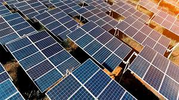
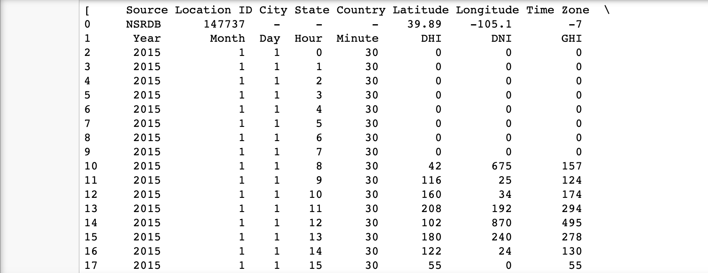
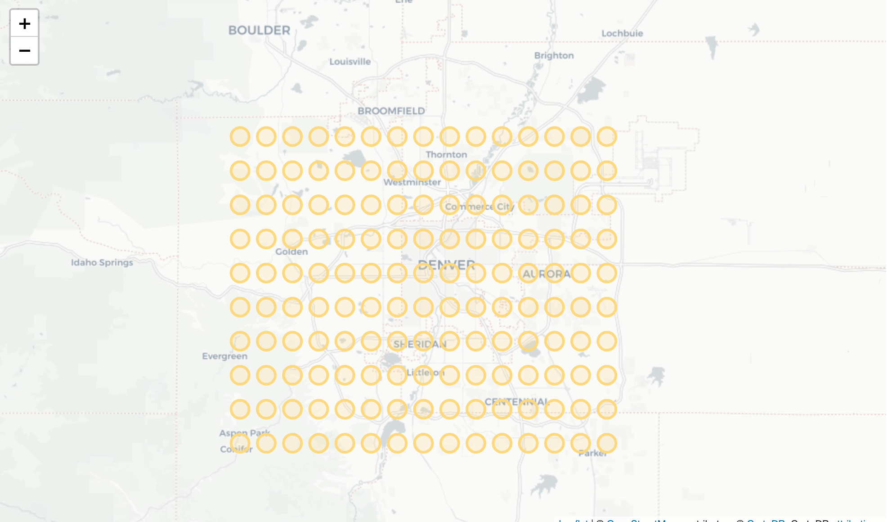
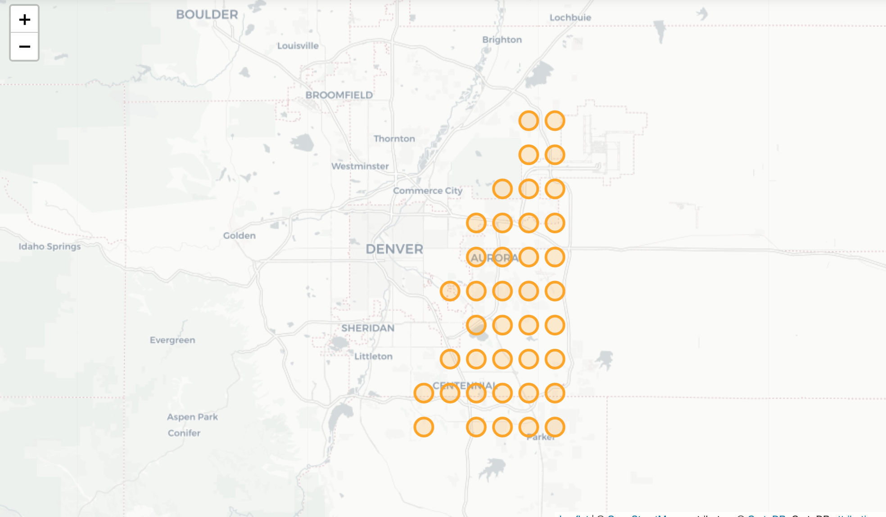
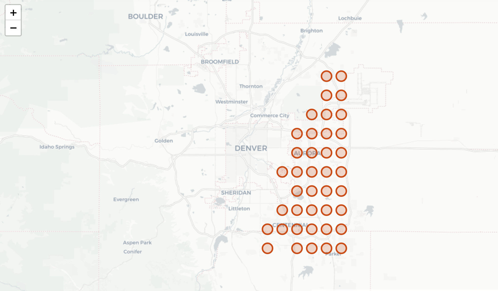

# SolarRadiation_model

    

## Table of Context 
### Introduction

Climate change is an ever present topic in the news today. Australia is literally on fire right now. The strive for global sustainability is of the utmost imprtance in todays current climate. That is why I decided to see if it was possible to help Denver take steps toward that sustainable future.

### Question

<li>Are there areas in Denver that recieve larger anounts of solar radiation as others?</li>
<li>Where in Denver does that happen?</li>
<li>Where would be the most cost effective place to set up a solar farm?</li>

### Data 

The data I used for this EDA was provided by NREL(National Renewable Energy Laboritory). The data consisted of measured and expected values of solar radiation devided into three different types of measured solar radiation(DHI,DNI,GHI). Direct Normal Irradiance(DNI) is the unit of measurement that I was most interested in because it has the highest values yielded of solar energy. 

### EDA

Once I decided on which values were most important I began to clean my data using pandas dataframes. My data came in multiple .csv files where each file corresponded with a specific point in Denver where solar radiation was measured. Each file mainly consisted of measured and expected values of solar radiation over every hour in 2015. Once I read in all my files into a pandas dataframe I formatted the data into a dictionary where the coordinates are keys and the measured values are saved to an array. 

    

### Visualizations

Once the data was formatted I first wanted to plot where the locations of where the measured data was taken from. 

    

After plotting all points of measurement using folium I realized that I needed to narrow my search on which points of location where production was the most. I created a couple new functions that averaged the measured values over the hours per year and them decided to plot the top 40 points to get a better idea of the location of a successful solar farm.

    

Once I narrowed down my location to southeast Denver I continued my search to see if the top producers of DNI matched the points of measurement for least difference average between measured DNI and expected DNI.

    

### Conclusion

The most effective solar farming locations in Denver are southeast of the city. This is most likely because south is closer to the equator and east is a flatter elevation versus west.

### Future Work

In the future I would like to plot values in the top 40 over time for the year of 2015 to get a better visualization of where in southeast Denver to plot a solar farm. 